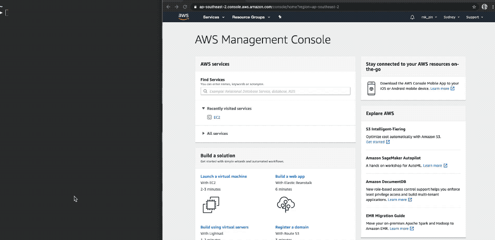
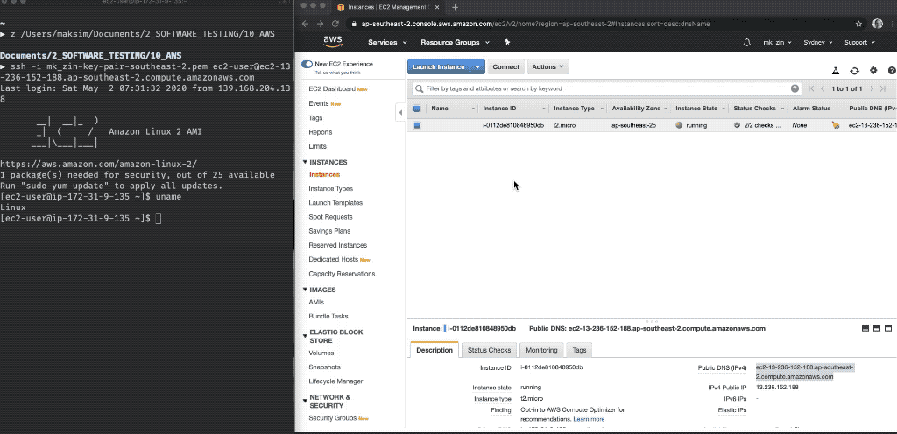
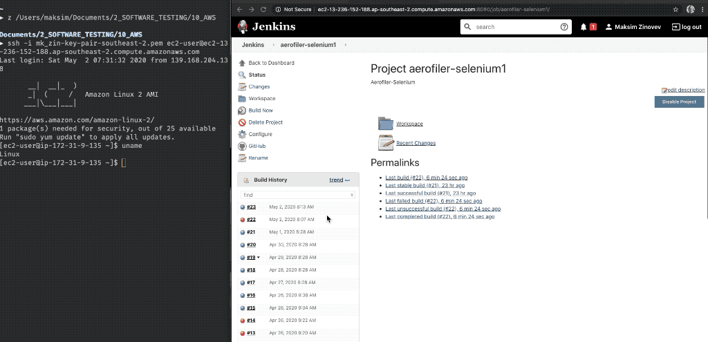

# Running Selenium web UI Tests on Remote  Machine  Using Jenkins and AWS EC2 Instance: Beginners Guide

 # Connect to EC2 Instance
 

 # Configure Build 
 

  # Check Results in Console Log
 


## **Create EC2 instance**

Detailed instructions can be easily found online. Here are the main steps

- Create Amazon AWS account

- Sign in as root user

- Set up with Amazon EC2

  - Create key pair
  - Save key in a safe place 
  - If you will use an SSH client on a Mac or Linux computer to connect to your Linux instance, use the following command to set the permissions of your private key file so that only you can read it.

  ``` 
  chmod 400 your_user_name-key-pair-region_name.pem
  ```

- AWS Management Console -> EC2

- Launch instance: instances -> select  instance -> actions ->start


## **Connect to EC2 instance using SSH**

- AWS Management Console -> EC2->Connect

- copy prompt from popup window and run in terminal
- you can copy public DNS from EC2 Management Console.  Key pair .pem file  was saved on your machine in previous steps. Public DNS can be found  on your EC2 console page once you launched the instance:

```
ssh -i <path-to-private-key/filename.pem> ec2-user@<your-public-dns>
```

- Success

```
       __|  __|_  )
       _|  (     /   Amazon Linux 2 AMI
      ___|\___|___|

https://aws.amazon.com/amazon-linux-2/

```

- More instructions  https://d1.awsstatic.com/Projects/P5505030/aws-project_Jenkins-build-server.pdf
- More instructions https://medium.com/@mohan08p/install-and-configure-jenkins-on-amazon-ami-8617f0816444


## Install and Start Jenkins

**Check for updates before proceeding**

```
sudo yum update –y
Loaded plugins: extras_suggestions, langpacks, priorities, update-motd
amzn2-core                                               | 2.4 kB     00:00
No Match for argument: –y
No packages marked for update
[ec2-user@ip-172-31-9-135 ~]$
```

**Add the Jenkins repo using the following command**:

```
sudo wget -O /etc/yum.repos.d/jenkins.repo http://pkg.jenkins-ci.org/redhat/jenkins.repo
```

**Import a key file from Jenkins-CI to enable installation from the package:**

```
 sudo rpm --import https://pkg.jenkins.io/redhat/jenkins.io.key
```


**Install Jenkins** 

```
 sudo yum install jenkins -y
```


**Succsess**

```
Installed:
  jenkins.noarch 0:2.232-1.1

Complete!
```


**If you Start Jenkins now you will get this error because Java not yet installed**

```
sudo service jenkins start
Starting jenkins (via systemctl):  Job for jenkins.service failed because the control process exited with error code. See "systemctl status jenkins.service" and "journalctl -xe" for details.
                                                           [FAILED]
```


**Install Java 1.8**

```
sudo yum install java-1.8.0
java -version
openjdk version "1.8.0_242"
OpenJDK Runtime Environment (build 1.8.0_242-b08)
OpenJDK 64-Bit Server VM (build 25.242-b08, mixed mode)
```


Now **Start Jenkins**

```
sudo service jenkins start
```


To stop Jenkins**

```
sudo service jenkins stop
```


**Connect to Jenkins via browser**.

```
 http://<your_server_public_DNS>:8080
```


To **start the jenkins service at boot-up**, you can run,

```
chkconfig jenkins on
```

or

```
systemctl start jenkins.service
systemctl enable jenkins.service
```


**Get the password using below command** and paste it to Jenkins window with password request, 

```
sudo cat /var/lib/jenkins/secrets/initialAdminPassword
```

Install suggested plugins


## Add Headless Option to Your Python Tests

If you use pytest it is quite easy to make a few changes in conftest.py to be able  run your tests either headless or in browser depending on argument passed to the tests. 

First we can add some options to change behaviour of our tests using pytest_addoption:

```
# conftest.py
def pytest_addoption(parser):
    parser.addoption("--headless", action="store_true", help="run headless tests")
    parser.addoption("--usesecret", action="store_true", help="read passwords from env variable")
```


Now we can use  ChromeOptions() to initialize  "headless" driver. I use fixture for driver  set up and clean up:

```
# conftest.py

@pytest.fixture(scope='module')
def browser_ms(pytestconfig):
    if pytestconfig.getoption('headless'):
        options = ChromeOptions()
        options.add_argument('headless')
        driver = Chrome(chrome_options=options)
    else:
        driver = Chrome()

    # Wait implicitly for elements to be ready before attempting interactions
    driver.implicitly_wait(16)

    # Return the driver object at the end of setup
    yield driver

    # For cleanup, quit the driver
    driver.quit()
```

Now we have two options. We can run our tests headless from remote machine:

```
pytest --headless tests/login
```

We can also run the same tests as usual on local machine in browser:

```
pytest tests/login
```


##   Set Up Jenkins and Create Jenkins job: Selenium Tests (Python) 

- Preconditions: Jenkins installed on ec2 instance

- navigate to https://aws.amazon.com/console/

- login as root user

- open ec2 console

- start ec2 instance:  instances -> select  instance -> actions ->start 

- connect to instance (see above)

- If you creatin Jenkins job for the first time:

- install git:

  ```
  sudo yum install -y git
  ```

- install chtomedriver **- !important - use stable release supported by Chrome browser which will be installed in the next step**

  Installing chromedriver https://understandingdata.com/install-google-chrome-selenium-ec2-aws/

  ```
  [ec2-user@ip-172-31-9-135 tmp]$ pwd
  /tmp
  [ec2-user@ip-172-31-9-135 tmp]$ wget https://chromedriver.storage.googleapis.com/83.0.4103.14/chromedriver_linux64.zip
  [ec2-user@ip-172-31-9-135 tmp]$ sudo unzip chromedriver_linux64.zip
  Archive:  chromedriver_linux64.zip
    inflating: chromedriver
  [ec2-user@ip-172-31-9-135 tmp]$ sudo mv chromedriver /usr/bin/chromedriver
  [ec2-user@ip-172-31-9-135 tmp]$ chromedriver --version
  ```

  

- install Chrome browser 

  ```
  sudo curl https://intoli.com/install-google-chrome.sh
  google-chrome --version
  ```

- install pip

  ```
  curl https://bootstrap.pypa.io/get-pip.py -o get-pip.py
  sudo python get-pip.py
  ```

- install virtualenv

  ``` 
  sudo python -m pip install virtualenv
  ```

- install python3

  ```
  sudo yum install -y python3
  ```

- start jenkins

- Jenkins--> System-->Global credentials (unrestricted)-->Add credentials

  - Username (use GitHub email)
  - Password  (use GitHub token, **NOT password**)
  - Description (GitHub)

- Jenkins --> Source Code Management --> GitHub project --> add Project url (copy from browser address bar)

- Jenkins --> Source Code Management -->Git --> add Repository url (copy from Clone/download)

- Jenkins-->  Source Code Management -->Build Triggers--> "H 8 * * *" - run once per day

- Jenkins-->  Source Code Management -->Build Environment--> "Delete workspace before build starts" 

- Jenkins-->  Source Code Management -->Build --> Execute shell-->Command

  ```
  virtualenv -p python3 venv
  source venv/bin/activate
  pip install -r requirements.txt
  pytest tests/login/test_login_valid.py -k test_site_title 
  ```

- Jenkins-->  Source Code Management--> Save

- Jenkins--> Project-->Build Now 

 