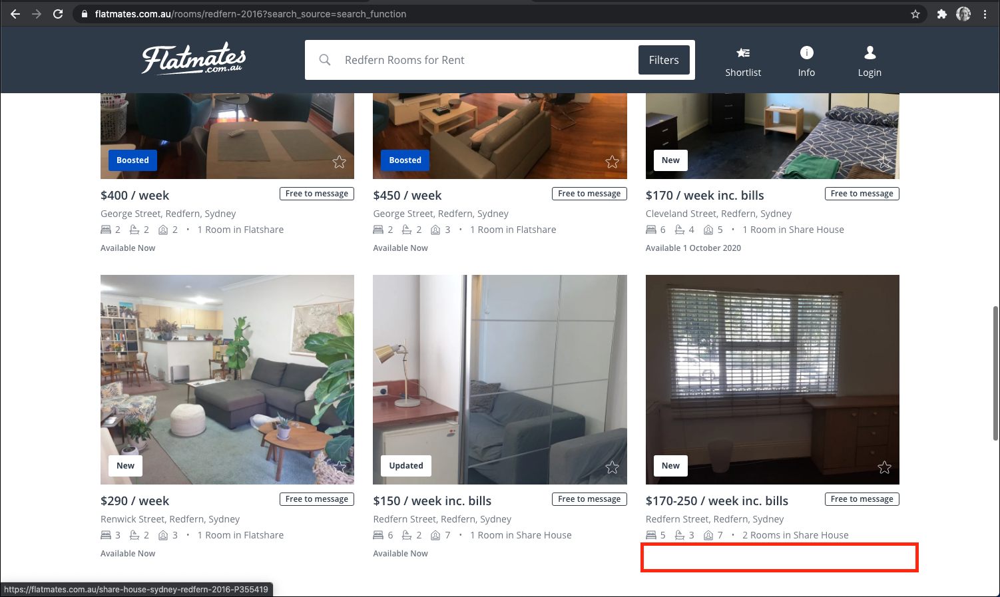
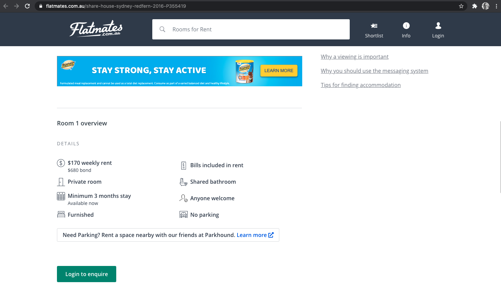
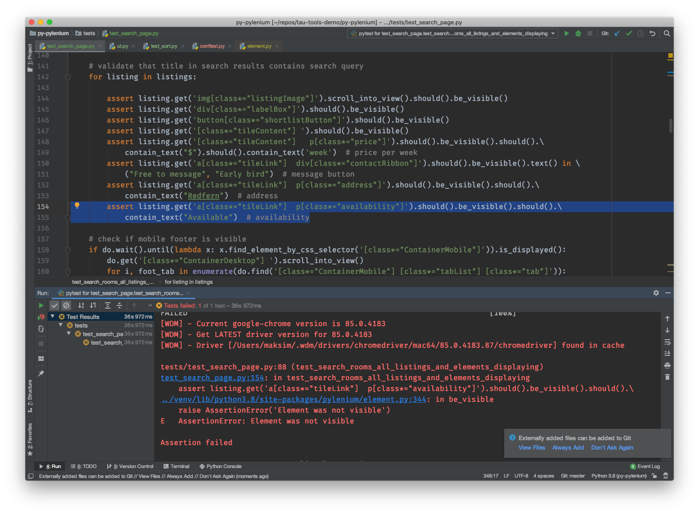

# Pylenium Demo Project

This is a short demo of web UI tests created using [Pylenium](https://elsnoman.gitbook.io/pylenium/) - awesome wrapper around the Selenium Webdriver Python API, which provides a more Pythonic interface.

[Flatmates.com.au](https://flatmates.com.au/) was used as a real website to practice writing Selenium tests. Please, do not be too strict. The code and tests are probably far from perfect. However, this project has helped me to learn some useful consepts and practices including:

- using pytest for testing
- Pylenium 
- synchronization in Selenium, WebDriverWait and Expected Condition
- web locators
- named tuples 
- @pytest.mark.parametrize()
- Pycharm IDE commands
- refactoring the code
- cleaning up the code

 # Example of  the Issue Found by Test

 
 
 

 