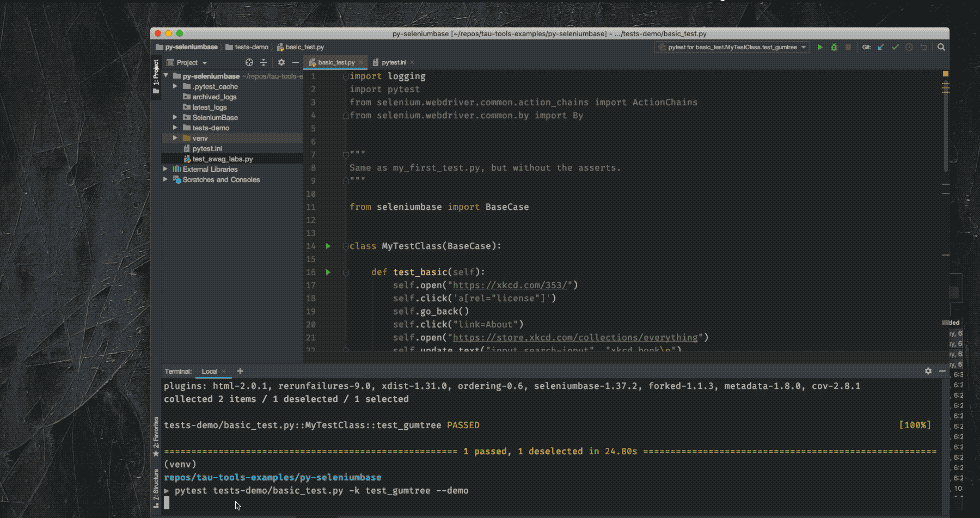

 # Web UI Automated Testing Using SeleniumBase framework and Python

SeleniumBase is an all-in-one framework for web automation, end-to-end testing, web presentations, and website tours. Tests are run with "pytest". Browsers are controlled by WebDriver.  

