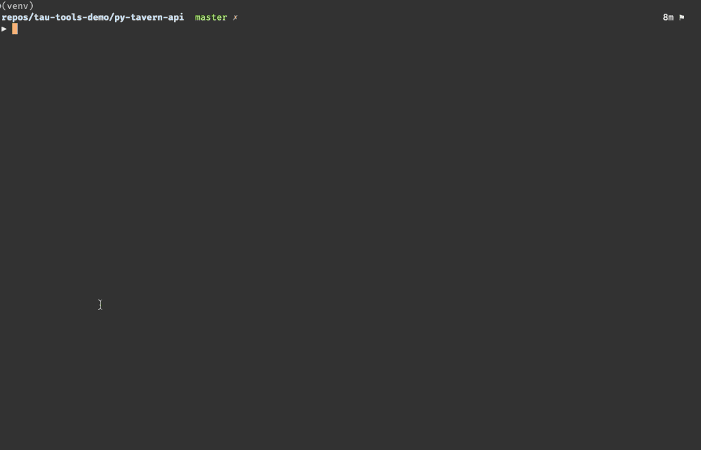

# Tavern Test Examples

> "Tavern is a **pytest** plugin, command-line tool and **Python** library for automated **testing of APIs**, with a simple, concise and flexible YAML-based syntax" (https://taverntesting.github.io/)

This repo contains 30+ simple  Tavern test examples. Might be helpful if you just started to learn  API testing using Python and Tavern. I used  free public APIs to go through Tavern documentation and learn how to use it:

- http://api.zippopotam.us/

- https://jsonplaceholder.typicode.com

- https://gorest.co.in/

- http://www.recipepuppy.com

- http://www.dropboxapi.com

  

Some examples of Tavern tests:

-  Sending request and checking response status code, json response, headers
-  Using external function to validate response

- Using built-in Tavern schema validators
- Test parametrization
- Multi stage tests
- Using external configuration files
- Uploading file
- Creating and reading resoures using APIs


# Tavern Docs

Feel free to read Tavern Documentation [Link](https://tavern.readthedocs.io/en/latest/basics.html).  It is well written and has plenty of examples.


# Getting Started

**If you clone this repo and  use PyCharm:**

- clone repo

- install dependancies

  ``` pip install -r requirements.txt
  pip install -r requirements.txt
  ```

- set up virtualenvironment 

- install colorlog 

- in PyCharm set pytest as default test runner (preferences-tools-python integrated tools-testing-pytest-apply)

- make sure your  yaml test is  called `test_x.tavern.yaml`, where `x` should be a description of the contained tests


I used  dotenv to inject my API keys in tests, so you will need to disable this section in  conftest.py: 

```
# conftest.py
# =========== disable this section and obtain your own API keys to run tests on your machine ================
# =========== see comments in test_basics.tavern.yaml, test_http.tavern.yaml ================================
try:
    load_dotenv()
    API_KEY_DROPBOX = os.getenv('API_KEY_DROPBOX')
    API_KEY_GOREST = os.getenv('API_KEY_GOREST')
except Exception as e:
    logging.info(f'disable try-except section at the top of conftest.py and obtain your own API keys to run tests '
                 f'on your machine: {e}')

# =====================================================================================================
```

Then replace  variable with your API_KEY, example:

```

stages:
  - name: Authenticate and add new random user
    request:
      url: https://gorest.co.in/public-api/users
      method: POST
      headers:
        Content-Type: application/json
        Authorization: "Bearer {tavern.env_vars.API_KEY_GOREST}"
        #  replace above variable with your API_KEY, example:
        #  Authorization: "Bearer 234dflkjdf967lkjdsf"
        #  go to https://gorest.co.in/user/login.html to register free account
```


**If you start your own project and use PyCharm:**

- create new project
- set up virtualenvironment
- install pytest
- install tavern
- install colorlog
- in PyCharm set pytest as default test runner (preferences-tools-python integrated tools-testing-pytest-apply)
- make sure your  yaml test is  called `test_x.tavern.yaml`, where `x` should be a description of the contained tests

# Tavern Docs and useful links 

Feel free to read [Tavern Documentation](https://tavern.readthedocs.io/en/latest/index.html). It is well written and has plenty of examples. 

There are not many articles and tutorials   on how to use Tavern. Here are  a few  links that I found:

- https://www.ontestautomation.com/writing-api-tests-in-python-with-tavern/
- https://medium.com/@ali.muhammadimran/rest-api-test-automation-using-python-with-tavern-ci-part-1-707026eae702
- https://apagiaro.it/tavern-test-api/


# Project structure example

```
.
├── LICENSE
├── __pycache__
│   ├── conftest.cpython-38-pytest-5.4.1.pyc
│   └── conftest.cpython-38-pytest-5.4.2.pyc
├── accounts.yaml
├── conftest.py
├── logging.yaml
├── pytest.ini
├── readme.md
├── requirements.txt
├── tavern-demo.gif
├── test_data
│   └── test_pdf.pdf
├── tests
│   ├── __init__.py
│   ├── __pycache__
│   ├── api_urls.yaml
│   ├── common.yaml
│   ├── includes.yaml
│   ├── includesA.yaml
│   ├── includesB.yaml
│   ├── test_basics.tavern.yaml
│   ├── test_http.tavern.yaml
│   ├── utils.py
│   └── yaml_basics.yaml
├── venv
│   ├── bin
│   ├── include
│   ├── lib
│   └── pyvenv.cfg
└── zip_code.yaml

```


# Some common mistakes to avoid

Of course you can read the docs, bu I decided to share some of my mistakes. Chances are you have the same problem which can be fixed quite quickly if you know where to look at.

# Adding folder to PYTHONPATH

To make sure that Tavern can find **external functions** you need to make sure that it is in the Python path. I had some issues with adding my test dir to PYTHONPATH. Seems like in different environments command may vary.  This is what works / does not work for me (I use zsh). For example, if **utils.py** is in the ‘tests’ folder:

**Not worked:**

```sh
 PYTHONPATH=$PYTHONPATH:/tests pytest tests/test_basics.tavern.yaml -k ex04
 ...
 E   tavern.util.exceptions.InvalidExtFunctionError: Error importing module utils
 
```

```sh
PYTHONPATH=$PYTHONPATH:tests pytest tests/test_basics.tavern.yaml -k ex04
 ...
zsh: bad substitution
```


**Worked**:

```
 PYTHONPATH=$PYTHONPATH:./tests pytest tests/test_basics.tavern.yaml -q -k ex04
```


You can modify  ~/.bash_profile  to add absolute path to your PYTHONPATH so you do not need to include PYTHONPATH in command each time (note, this might affect other projects, so just comment it out when you do not need it) . For Example:

```
export PYTHONPATH="$PYTHONPATH:/Users/maksim/repos/tau-tools-demo/py-tavern-api/tests"
# save and exit
# then run in shell or in PyCharm terminal:
source ~/.bashprofile

```

# Some tips found in GitHub.../tavern/issues and Tavern documentation

**Handling  "/" and curly braces "{"**:

```yaml
marks:
  - bugdemo
  - parametrize:
      key: [line, text]
      vals:
        # NOTE: "\" requires doubling, !raw will take care of "{" and "}"
        - [1, "XYZ[\\]^_`abcdefghijk"]
        - [2, !raw "lmnopqrstuvwxyz{|}~*"]
```


# Including external files:

Note : common.yaml  must include **only one document**

```

---

name: Common test information
description: Some information for tests
...
```


# Using saved vars

**Incorrect:**

```
id: {user_id}
```

**Correct:**

```

id: "{user_id}"
```


# Printing entire response using logging

Add this hook to your contest.py file to be able to see response even if it retured not in json format:

```python
#conftest.py

def pytest_tavern_beta_after_every_response(expected, response):
    try:
        logging.info(f"================= RESPONSE ================== "
                     f"\n\nstatus code [{response.status_code}]\n{dumps(response.json(), indent=4)}\n\n")

    except ValueError as e:
        logging.info(f"================= RESPONSE ================== "
                     f"\n\nstatus code [{response.status_code}]\n{response.text,}\n\n")
    return
```


**Use --log-cli-level  in command line to enable different logging levels. Example**

```
pytest --log-cli-level=ERROR  snippets/test_basics.tavern.yaml
```


**Can also use pytest.ini  to set logging level:**

```
log_cli = 1
log_level = INFO
log_cli_level = INFO
```


Example of pytest.ini

Here is what I have in my pytest.ini file

```
[pytest]
tavern-global-cfg=
    snippets/common_snippets.yaml
    tests/common.yaml
    tests/secrets.yaml
    snippets/api_urls.yaml
tavern-strict=json:off
tavern-beta-new-traceback = True

filterwarnings =
    ignore::UserWarning
    ignore::ImportWarning
    ignore::ResourceWarning

testpaths = ​tests​, snippets
addopts =
    --doctest-modules
    -r xs
    -p no:warnings
    -vv
    --tb=short


log_cli = 1
log_level = INFO
log_cli_level = INFO
log_cli_format = %(asctime)s %(levelname)s %(message)s
log_cli_date_format = %H:%M:%S
```


 

